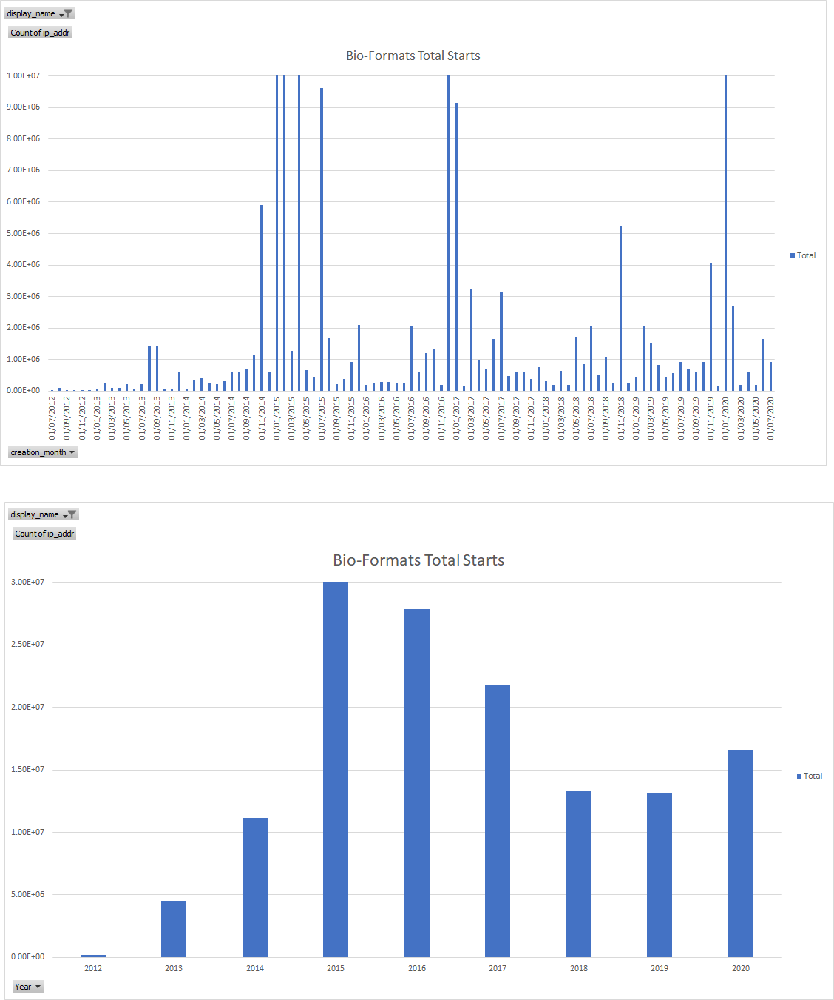
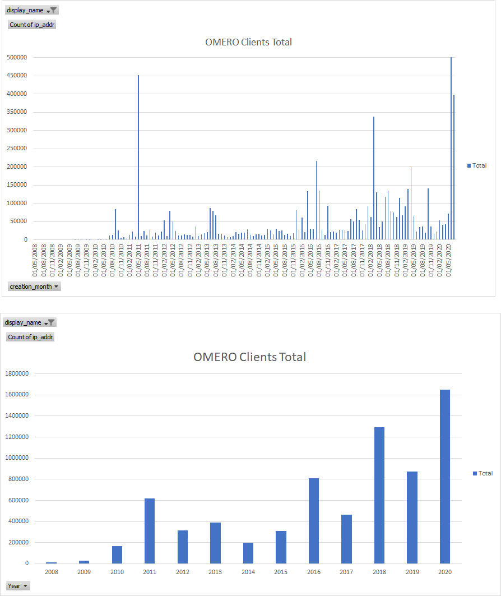
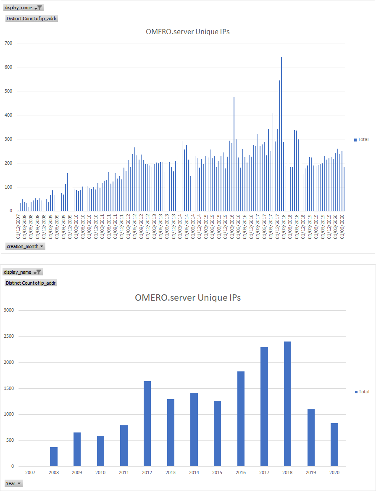

Attending: Will, Jason, Jean-Marie, June, Mark, Melissa, Petr, Frances,
Seb, Josh, David, Dom,

Kevin, Erin, Wilma, Chris, Emil

Start: 2:00 pm

1. Accepting minutes from [<u>last meeting</u>](https://drive.google.com/open?id=0B9Xg53EhqUycZEVHclBwRHNFRGM)
--------------------------------------------------------------------------------------------------------------

2. Project Status
-----------------

(2-3 minutes each)

-   IDR:

    -   Seb: release planned for tomorrow. 3 studies.

        -   Idr0082 pathology, mouse (idr0092), HPA

        -   But: Antibody annotations in incompatible state - fix tested
            > on pilot - looking good for release tomorrow.

-   NGFF:

    -   Josh: few PRs opened recently

        -   Can discuss after this meeting

        -   Color handling proposals - see
            > [<u>omero-ms-zarr</u>](https://github.com/ome/omero-ms-zarr/issues/62)
            > issue

    -   OME-TIFF ‘slow’ (image.sc discussions)

        -   [<u>https://forum.image.sc/t/bio-formats-clij-compatibility/42157/5</u>](https://forum.image.sc/t/bio-formats-clij-compatibility/42157/5)

-   OMERO 5

    -   Josh: omero-py / omero-web releases upcoming?

        -   Omero-py release when Simon is back

        -   Omero-web - fix for Qupath - need wider feedback on response
            > code change

            -   Seb: big changes coming. If this is a bug-fix (small
                > impact) then should get it out. Will can drive
                > release.

        -   Jason: good to get schedule defined

    -   Mark: Deep copy PR is open

        -   Josh: tried to build whole OMERO stack in Docker using open
            > PRs -

        -   Much more work? Mark: not a whole lot. But lots of scenarios
            > to test

        -   Currently only testable via the CLI & API. May conflict with
            > web chown work.

        -   Concern over testing deep-copy on merge-ci - make snapshot

-   SA

-   Glencoe:

    -   TileDB stuff being pushed to bioformats2raw

        -   Some upstream changes requested to improve portability

-   Community

    -   

3. AOB
------

(5 min. max; tech. Discussion should be highlighted to relevant people
and rescheduled)

-   Scheduling of next week's team meeting.

-   HPA talk at 2pm next Tuesday.

-   Go for 4pm - 4.30pm try to keep it short

4. Main Topic
-------------

(20-25 minutes plus 15 minutes questions max)

Usage Stats: upgrade checks - total vv unique IPs

Zarr fun if desired

\- All PRs in ‘sets of 3’ omero-ms-zarr (spec), ome-zarr-py &
omero-cli-zarr,

\- ome-zarr-py \#45 lots of changes. Black formatting etc. pre-commit
file.

\- mypi - specify return types. Work to add, but useful for refactoring

\- conda environment.yml - not many versions pinned yet. Might be
needed.

\- testing qt via github actions is hard. OS-specific.

\- ome-zarr create - to create sample data. Avoid hitting s3 in testing

\- Main change: graph traversal API. entry point: parse\_url()

\- also split out napari logic.

\- separate our metadata from napari spec. E.g. ‘contrast\_limits’

\- Chris: we’ve had issues with graph traversal on s3 - xarray any use?

> \- Josh: that’s using fsspec. Could support /add that in our api

\- Layer (from napari) hard to know what’s in the tuples.

> \- need to add labels ‘on top’ - layer opacity allows other layers
> below

\- Other types possible - e.g. image-image links.

\- Need a name for hierarchy of data ‘layers’ with metadata

\- Hierarchy is converted into ordered list of layers, retaining the
relationships between them.

\- Reader class - uses ‘yeild’ generators everywhere, but not used
anywhere yet - napari wants everything up front.

\- Scaler class - used for downsampling. Used by omero-cli-zarr so that
it saves downsampled labels.

\- Can now download any image with labels (both as pyramids) and open in
napari.

\- naming needs deciding on: e.g. labels layers are identified by
‘color’ metadata.

Expect more discussions in public when released.

Bio-Formats Total

Bio-Formats Unique

OMERO Clients Total

OMERO Clients Unique

OMERO server Unique

